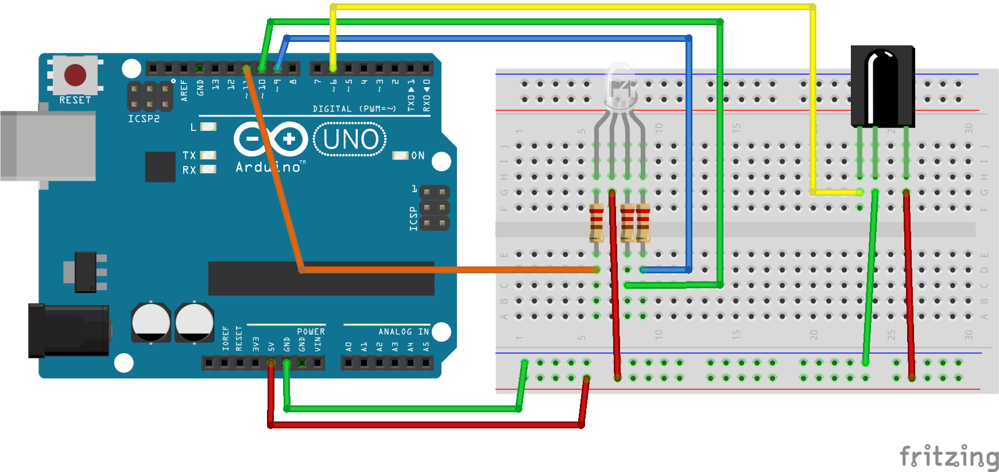
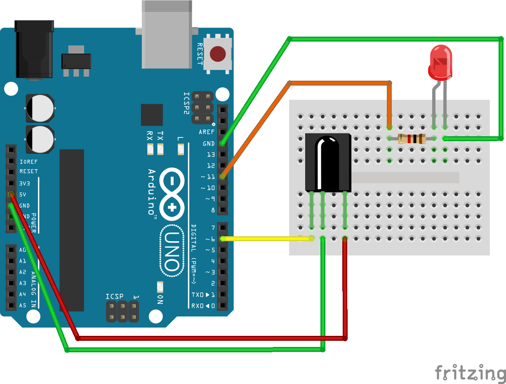

# Arduino-IRWand
Simple Arduino Uno project that allows a LED to be triggered (change colors or turned off/on) by an IR blaster wand. The wand could easily trigger something other than a LED, but that part is left up to you.

## IRremote Dependency
This sketch leverages [mpflaga's branch](https://github.com/mpflaga/Arduino-IRremote) of the [IRremote library](https://github.com/shirriff/Arduino-IRremote). This branch supports the specific codes/decodes of the wands. The wands themselves are from a chain of hotels for a quest game, but any IR blaster could be used if it follows the same format.

Copy the IRremote directory for the branch of IRremote into C:\arduino\libraries (or wherever you have installed the Arduino IDE). You may get a message that it conflicts with RobotIRremote, which is another version of IRremote that comes with the Arduino IDE, that doesn't have wand support.
```
Multiple libraries were found for "IRremote.h"
 Used: C:\arduino\libraries\IRremote
 Not used: C:\arduino\libraries\RobotIRremote
```
If you get this message then it is likely safe to ignore. If you get something else, then you'll probably need to dig into it.
 
## Wiring
For input, this project requires an IR sensor. I used TSOP38238, which is very common and cheap. The pin used by the program is the same for the IR sensor regardless of the LED used. Please consult the specs of your IR sensor to determine if there are any special requirements.

The output of this project requires an LED of some sort for providing feedback for folks doing the wand waving. Two different LEDs are supported: a single color LED, such as a red LED, or a tri-color LED that is capable of blending colors. The tri-color LED allows for more interesting feedback, but the single color LED wiring is simpler and quicker to get setup. Both wiring diagrams are shown below. By default the sketch is setup to use the tri-color LED, which is controlled by the SINGLE_LED constant at the top of the sketch. The LED should still work if you don't have that constant set correctly, but you may get weird results (ex. the tri-color LED will just light up red).

For all of the LEDs, I used 1K Ohm resistors which is a safe bet if you don't know the specifics of your LED (I make no guarantees though). However, you can often increase the brightness of the LED by using a lower Ohm resistor if your LED will support it. Either way, it is generally always a good idea to use a resistor with an LED. Please consult the specs of your LED to determine what to use.

### Tri-Color LED
For the tri-color LED, please note there are two types: Cathode and Anode. Cathodes should have their long pin connected to ground (GND) and the Anodes have their longest pin attached to power (5V), so please ensure you are adjusting your wiring accordingly. The diagram below shows wiring for an anode LED. This also changes the logic for setting the colors. In the sketch that logic is controlled by the COMMON_ANODE define. Please comment that definition out if you are using a common cathode LED, otherwise your colors will be flipped.



## Single Color LED

