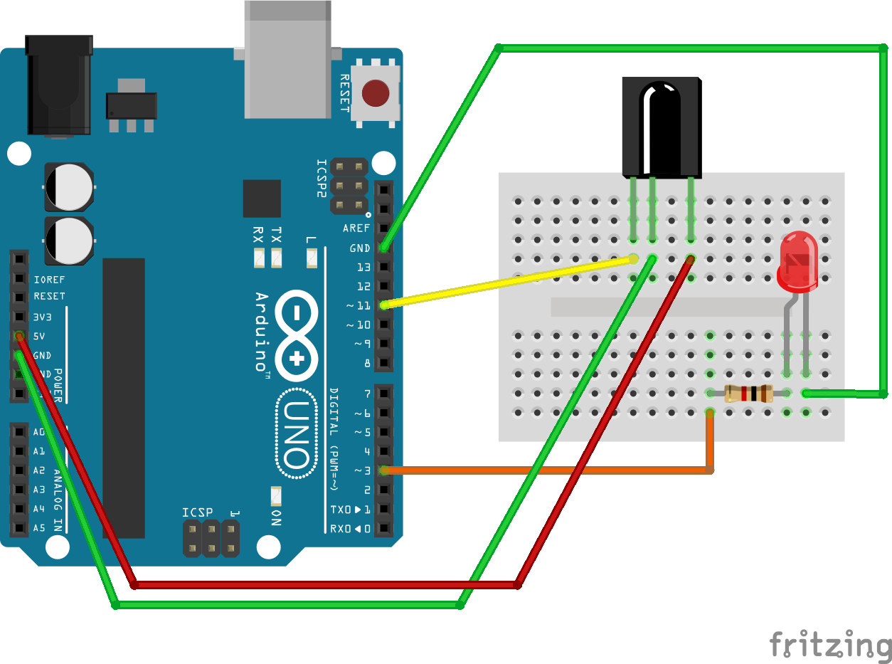

# Arduino-IRWand
Simple Arduino project that allows a LED to be triggered by an IR blaster wand. The wand could easily trigger something other than an LED, but that os going to depend greatly on what hardware you have at hand.

##Usage
This sketch leverages [mpflaga's branch](https://github.com/mpflaga/Arduino-IRremote) of the [IRremote library](https://github.com/shirriff/Arduino-IRremote). This branch supports the specific codes/decodes of the wands. The wands themselves are from a chain of hotels for a quest game, but any IR blaster could be used if it follows the same format.

Copy the IRremote directory for it into C:\arduino\libraries (or where ever you have installed the Arduino IDE). You'll get a message when using that it conflicting with RobotIRremote, which is another version of IRremote, that doesn't have wand support. You should be able to safely ignore these messages.

Here is a diagram of what I had setup. PIN 3 controls a simple LED, turning it off and on, and PIN 11 receives the IR input.
